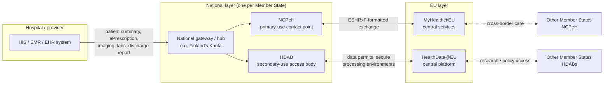

# Gateway market and API status

This file addresses the market-opportunity question directly: how does the MyHealth@EU/NCPeH architecture work today, who is likely to build and operate the connecting gateways, what vendor activity is actually confirmed vs. speculative, and — critically — are the underlying technical APIs (EEHRxF) decided, or still being specified, and by whom?

> ⚠️ **Source-quality note carried over from the underlying research**: A significant number of primary sources (streetinsider.com, newswire.com, pharmiweb.com, globeandmail.com, financialcontent.com, globenewswire.com, streamlex.eu, better.care) were blocked by the research environment's network egress proxy and could not be fetched directly. Findings below that derive from these sources are based on search-engine-synthesized snippets, not direct reads, and are flagged accordingly.

## Architecture at a glance

*One national-monopoly gateway per country connects local HIS/EMR systems to both EU tracks — see [confirmed vs. speculative vendor activity](#confirmed-vs-speculative-vendor-activity) below for who builds the gateway itself.*

## How MyHealth@EU/NCPeH is architected today

MyHealth@EU (eHDSI) is a **federated architecture**: the European Commission runs shared central/cross-cutting ICT services (terminology, configuration, cross-border trust), and each Member State builds and operates exactly **one National Contact Point for eHealth (NCPeH)** that connects to it — a **single national gateway per country, not a competitive multi-vendor field**. Live, open-source implementations already exist (OpenNCP), and a FHIR-based successor is in active development — the full architecture, the live epSOS/eHDSI workflow, and the FHIR migration status all have their own dedicated chapter: see **[07-cross-border-exchange.md](07-cross-border-exchange.md)**.

**HealthData@EU** (secondary use) is a separate, newer node-based network connecting national HDABs/health data hubs to an EU Central Platform via the eDelivery AS4 building block. Identified pilot nodes include BBMRI, Health Data Lab (Germany), Danish Health Data Authority (Denmark), **Findata (Finland)**, Health Data Hub (France), Sciensano (Belgium), Norwegian Directorate of eHealth (Norway), and the Croatian Institute of Public Health (Croatia) ([PMC — Piloting an infrastructure for secondary use of health data](https://www.ncbi.nlm.nih.gov/pmc/articles/PMC12420900/)). Its technical components are: (1) information systems for national metadata catalogues, (2) information systems for cross-border data access applications/requests, and (3) secure processing environments; it uses the EU's eDelivery Building Block (AS4 protocol) for secure machine-to-machine connectivity ([PMC / EU Digital Building Blocks](https://ec.europa.eu/digital-building-blocks/sites/pages/viewpage.action?pageId=592643692)). Release 3 of the eDelivery AS4 cross-border gateway introduced the **"HealthData@EU Health Data Dispatcher,"** replacing the earlier EHDS2 Pilot connector while keeping the same API ([EU Digital Building Blocks](https://ec.europa.eu/digital-building-blocks/sites/x/T2bkN)).

## Is the gateway layer open to competition?

**Not at the "which gateway do I connect to" level.** The NCPeH model is structurally a **national monopoly gateway per country** — one designated national contact point. But **vendor competition happens one level down**: the national eHealth agency/ministry that owns the NCPeH mandate typically procures the underlying software/integration platform through public tenders, so IT vendors compete to be *the* contracted technology supplier/system integrator behind a given country's NCPeH, rather than operating parallel competing gateways. This matches the pattern seen in France (ANS as public operator, likely contracting technology suppliers) and Cyprus (NeHA as public operator) — this is analysis based on those examples, not a confirmed general rule stated by any single source.

This national-monopoly-gateway-with-vendor-competition-for-the-contract pattern is analogous to, and likely to be reused for, the new national EHDS primary-use and secondary-use touchpoints — i.e., a single national gateway/HDAB per country, with the technology stack behind it awarded via national procurement to established health-IT integration vendors.

> ⚠️ **Unverified / conflicting sources**: No comprehensive, country-by-country list confirming which named IT vendors are the current contracted technology suppliers behind each country's NCPeH was found. No confirmation was found of whether any Member State currently allows more than one parallel/competing NCPeH-equivalent gateway.

## Does every hospital need a direct connection, or do national gateways absorb the complexity?

Existing precedent (Finland's Kanta — see [03-finland.md](03-finland.md)) and emerging descriptions of national EHDS layers both point toward **a small number of centralized national hub(s)/gateway(s)** that hospitals and HIS/EHR systems connect into, rather than every hospital independently building a connection to EU-level infrastructure. In Finland, social and healthcare providers are legally mandated to connect to Kanta, and data entered in a local EHR is automatically transferred to the central repository ([Findata.fi](https://findata.fi/en/course/finnish-health-care-system/lessons/kanta-services-patient-data-repository/)); Kanta itself serves as Finland's NCPeH, and THL states Kanta is "central" to EHDS implementation ([THL](https://thl.fi/en/-/kanta-services-are-central-in-implementing-the-ehds-regulation-in-cooperation-with-all-actors)).

A described (search-synthesized, primary source not directly fetched) architectural pattern for national EHDS implementation layers involves three components sitting between hospital systems and the pan-EU infrastructure: (a) a shared care record providing a clinically coherent normalized data foundation (often built on **openEHR**), (b) a vendor/EHR integration layer that federates and harmonizes outputs from diverse hospital EHR systems, and (c) a national EHDS gateway that exposes a unified FHIR façade applying semantic and consent rules before data crosses the border ([search synthesis of better.care blog content](https://www.better.care/blog-en/ehds-infrastructure-platforms/)). For the secondary-use side, national architecture is described as having three conceptual components: "Cross-Border Engines" integrated into the national HDAB, and a "National Connector" and "Cross-Border Gateway" integrated into the National Contact Point ([search synthesis, likely sourced from a Tehdas/EU architecture deliverable](https://tehdas.eu/results/new-specification-supports-member-state-connection-to-healthdataeu/)).

The most probable realistic architecture in most Member States is a small number of centralized national gateway(s)/hub(s) per country (in many cases pre-existing national eHealth infrastructure, extended) that hospital HIS/EMR systems connect to. This is a reasonable inference from precedent and vendor commentary, **not a confirmed regulatory mandate** — the EHDS Regulation's "common specifications by 2027" provision (Article 36) appears to set *what* interoperability requirements EHR systems and national infrastructure must meet, while the *internal* national wiring (how many gateways, which agency runs them) looks to be left to Member States, consistent with the federated NCPeH precedent.

> ⚠️ **Unverified / conflicting sources**: No source found explicitly states that the Regulation mandates a specific number of national gateways; this appears to be left as an implementation choice. The exact operative text of the Regulation's articles on national architecture/hospital connectivity could not be directly verified (EUR-Lex and streamlex.eu's Article 36 breakdown were not directly fetchable).

## Confirmed vs. speculative vendor activity

There is market activity explicitly branded around EHDS interoperability/middleware, but **nearly all of this evidence traces back to press releases from a single market-research firm, Black Book Research**, which could not be independently verified by directly reading the primary press-release text in this research. Treat everything in this section as **directional signal, not confirmed fact**, unless otherwise noted.

| Vendor | Claimed activity | Confidence |
|---|---|---|
| **Dedalus** (Italy/France) | Described as "the first large vendor to re-architect middleware specifically for EHDS," with product **"Dedalus X-Interop"** already deployed in multiple national tenders; "continues to dominate regional interoperability" in Italy; named a "Compliance Anchor" in Black Book's "2025 Middleware Mandate Report" | Speculative / single-source (Black Book press releases) |
| **InterSystems** | HealthShare/TrakCare platforms widely adopted by NHS (UK) and Ireland; "recognized as a Europe-wide vendor leader for interoperability" in EHDS vendor rankings; listed among leading vendors for EHDS readiness in Austria; InterSystems, Orion Health, and the Ripple Foundation described as leading NHS "Spine 2" EHDS API pilots | Speculative / single-source |
| **Better** (Slovenia/UK) | Described as "emerging as the leading openEHR-native platform," "first to service" EHDS-ready API projects in Nordic and UK pilots | Speculative / single-source |
| **Marand** (Slovenia) | Described as powering Slovenia's national projects and UK/Nordic EHDS pilots with its "Think!EHR" openEHR middleware | Speculative / single-source |
| **CompuGroup Medical (CGM)** | Described as aligning middleware products with Germany's gematik ePA standards, "extending toward EHDS compliance" | Speculative / single-source |
| **Siemens, Vitagroup, Agfa** | Described as competing in Germany's "sovereignty-driven tenders" alongside CGM | Speculative / single-source |
| **Epic, Oracle Health (Cerner)** | No EHDS-specific statements found; only general US-centric EHR integration/FHIR comparisons surfaced | No evidence found (absence, not disconfirmation) |
| **CGI** | No evidence found of a CGI-branded EHDS product; plausible (given CGI's public-sector systems-integration business model) that CGI would compete as a systems integrator/contractor for national NCPeH/HDAB tenders rather than as a product vendor | Inference only, no supporting source |
| **Redox, Mirth Connect/NextGen Connect, Kodit.io** | No direct evidence found of these integration-engine vendors branding a product as an "EHDS gateway/connector"; searches returned only generic (non-EU/EHDS-specific) integration-engine positioning | No evidence found |

Specific claims and their sourcing:

- "EHDS-related middleware is projected to be a **€7 billion market by 2027**" — [search synthesis of Black Book Research press release, 28 Aug 2025](https://www.newswire.com/news/black-book-research-unveils-first-pan-european-study-of-ehds-22630969), primary text not directly fetched. **Treat this figure with caution** — it comes from a market-research firm's promotional press release, not an independently audited market-sizing report.
- "Only **13% of Healthcare IT Users** say vendors are EHDS-ready," headlined "Europe is Connected, But Not Yet Interoperable" — [Newswire, ~Dec 2025](https://www.newswire.com/news/black-book-study-finds-europe-is-connected-but-not-yet-interoperable-22799022), primary text not directly fetched.
- Black Book's **"2025 Middleware Mandate Report"** (~22 Sept 2025) is described as the "first global vendor benchmarking tied to TEFCA and EHDS compliance" — [markets.financialcontent.com](https://markets.financialcontent.com/stocks/article/accwirecq-2025-9-22-black-book-research-releases-2025-middleware-mandate-report-first-global-vendor-benchmarking-tied-to-tefca-and-ehds-compliance), primary text not directly fetched.

Because almost all vendor-specific, EHDS-branded market activity found traces to one market-research firm's press releases rather than to vendors' own press releases or product pages, this evidence should be treated as **directional signal of a genuine emerging market category**, not confirmed fact. It is plausible that incumbent middleware/interoperability vendors with an existing EU health-IT footprint (Dedalus, InterSystems, CGM) are moving fastest to brand around EHDS, while smaller openEHR-native/API-first challengers (Better, Marand, Ripple Foundation) position themselves as more agile alternatives — but specific rankings, percentages, and the "€7 billion by 2027" figure should be treated as promotional/directional rather than audited.

The near-total absence of EHDS-specific messaging found from Redox, Mirth/NextGen, Rhapsody/Orion Health (outside the UK Spine 2 mention), and Kodit.io suggests that, as of late 2025/2026, EHDS-specific go-to-market positioning is still concentrated among vendors that already have a strong EU public-sector health-IT presence, rather than being broadly adopted across the global health-IT integration-engine vendor landscape. This is an inference from an absence of search results, which is weaker evidence than a positive finding.

> ⚠️ **Unverified / conflicting sources**: No direct access to any vendor's own press release or product page (dedalus.com, intersystems.com, better.care, cgm.com) was possible during research to confirm EHDS-specific product names, feature sets, or customer case studies in the vendors' own words. No information was found on Kodit.io or on Nordic-specific health-IT integrators (e.g., TietoEvry, Systematic) branding products around EHDS specifically, beyond a 2019 (pre-EHDS) partnership mention between Better by Marand and Tieto.

## Are established core EMR/HIS vendors building EHDS connectivity in-house, or relying on third-party integration engines?

Evidence points to established core EMR/HIS vendors **with an existing EU public-sector footprint** (Dedalus, InterSystems, CompuGroup Medical) building/re-architecting their **own** middleware layers for EHDS rather than relying purely on third-party integration engines. Dedalus's "X-Interop" and InterSystems' HealthShare (built on the same technology foundation as its TrakCare EMR) are both vendor-owned interoperability platforms, not third-party add-ons. **Epic and Oracle Health (Cerner)**, the two dominant EMR vendors globally, showed **no EHDS-specific material** in the searches conducted — this may reflect limited public EHDS positioning to date, or simply that this information was not surfaced by search; it should not be read as evidence they are inactive.

The pattern suggests EMR/HIS vendors with a substantial existing public hospital/government-tender footprint in the EU are the ones investing in EHDS-branded native middleware, likely because they are directly exposed to EU national procurement requirements and government pressure. Epic and Oracle Health, whose primary market presence is the US, may be moving more quietly or later, or may rely more on third-party integration engines/regional system integrators for EU cross-border connectivity — but this is an inference from absence of evidence, not a confirmed vendor strategy.

## Standards status: is the EEHRxF finalized?

**No.** The European Electronic Health Record Exchange Format (EEHRxF) is **not yet finalized** — but see [06-api-drafts-and-specifications.md](06-api-drafts-and-specifications.md) for the actual draft FHIR Implementation Guides, package IDs/versions, and real example resources, read directly from the source repositories rather than search synthesis. "The EEHRxF will become formally established by March 2027. Until then, the European EEHRxF is still under collaborative development, and certainty about its specifications cannot be provided before the formal publication of the Implementing Acts by the European Commission" — [Frontiers in Medicine policy brief, "Accelerating European electronic health record exchange format (EEHRxF) implementation across Europe: a policy perspective," published 9 September 2025](https://pubmed.ncbi.nlm.nih.gov/40995096/).

Multiple tracks are contributing to the eventual specification, none of them yet final or officially adopted as *the* EEHRxF:

- **A joint action on primary use of health data**, funded under the EU4Health work programme 2022, aims to provide recommendations for a formal description of the EEHRxF; EU-funded projects **X-eHealth** and **XpanDH**, alongside projects funded under Horizon Europe call HORIZON-HLTH-2023-IND-06-02, also contribute ([Frontiers in Medicine policy brief](https://www.frontiersin.org/journals/medicine/articles/10.3389/fmed.2025.1648170/full)).
- **HL7 Europe** published (announced 2 January 2026) new FHIR Implementation Guides specifically designed to support EHDS: Base and Core FHIR IGs at **"Standard for Trial Use" (STU)** status for both FHIR Release 4 and Release 5, plus an HL7 Europe Extensions package ([HL7 News, 2 Jan 2026](https://hl7news.hl7.org/2026/01/02/new-hl7-europe-fhir-implementation-guides-to-support-the-european-health-data-space/)). These provide a layered approach: loosely-constrained "Base" profiles for common European concepts (Patient, Practitioner, etc.), with "Core" and further derived/national profiles built on top ([HL7 Europe Base and Core FHIR IG](https://build.fhir.org/ig/hl7-eu/base/introduction.html)).
- **IHE Europe and HL7 Europe** are jointly running **"EURIDICE"** (European Interoperability Specifications for Digital Solutions in Healthcare), where every accepted proposal becomes a joint specification combining IHE profiling methodology with FHIR technical expertise, explicitly aimed at producing community-validated technical artifacts supporting EHDS requirements ([EURIDICE](https://euridice.org/); [IHE Europe white paper, Jan 2025](https://www.ihe-europe.net/sites/default/files/2025-01/IHE-Europe%20-%20White%20Paper%20-%20Leveraging%20IHE%20Methodology%20to%20accelerate_v8.pdf)).
- **CEN/TC 251** is the CEN technical committee responsible for health informatics/ICT standardization in the EU, with the explicit remit of achieving compatibility and interoperability between independent systems and enabling modularity in EHR systems ([CEN/TC 251 Business Plan](https://standards.cencenelec.eu/BPCEN/6232.pdf)). Standardization "requests" (formerly "mandates") are formal, legally binding contracts between the European Commission and CEN/CENELEC (and sometimes ETSI) in support of legislative work, with contractually binding deliverable deadlines ([CEN-CENELEC guidance on standardization requests/mandates](https://boss.cenelec.eu/reference-material/guidancedoc/pages/mandates/)).
- Under the Regulation, by **26 March 2027** the European Commission must adopt "common specifications" via implementing acts covering the essential requirements in **Annex II** (interoperability/security requirements for EHR systems), including a common template and an implementation time limit; where these specifications intersect medical devices, in-vitro diagnostics, or high-risk AI systems, the Commission may consult the Medical Device Coordination Group, the European Artificial Intelligence Board, and the European Data Protection Board first (search synthesis of Article 36; authoritative text at [EUR-Lex](https://eur-lex.europa.eu/eli/reg/2025/327/oj/eng)).

The overall picture is a **multi-track, not-yet-converged standards process**: HL7 Europe and IHE Europe are producing draft/trial-use technical implementation guides now (2025–2026), which are likely to feed into — but are not yet identical to — the Commission's eventual legally-binding "common specifications" due by March 2027. **CEN/CENELEC's formal standardization-mandate role in this specific EHDS process was not directly confirmed by name** in the sources found (no EHDS-specific CEN/CENELEC mandate document was located), so its concrete contribution to EHDS technical specs — as opposed to CEN/TC 251's general, longstanding remit — remains an open gap.

Because Standard-for-Trial-Use (STU) status explicitly signals "not yet final and subject to change," a vendor building against the current HL7 Europe FHIR IGs today (2026) is building against material likely to see structural changes before the Commission's common specifications are legally finalized.

> ⚠️ **Unverified / conflicting sources**: No source names a specific CEN/CENELEC standardization mandate number tied explicitly to the EHDS Regulation. No EHDS-specific source confirms which clinical terminologies (SNOMED CT, LOINC, ICD-11) will be mandated in the EEHRxF/common specifications — general background exists on these terminologies, but nothing ties them explicitly to a confirmed EHDS mandate. The full text of Article 36 (and surrounding articles on EHR system essential requirements, Annex II) could not be directly verified from a primary source.

## When will specs be stable enough to build a low-risk production connector?

Based on the confirmed EEHRxF and common-specifications timeline, vendors building EHDS connectors **before roughly March 2027** are working against draft/trial-use material (HL7 Europe STU FHIR IGs, EURIDICE joint specifications) that carries meaningful rework risk. A reasonable vendor-risk framing (this paragraph is analysis, not a directly confirmed assessment from any source):

1. **2025–2027 ("draft/pilot" window)**: building against HL7 Europe STU FHIR IGs, EURIDICE joint specs, and national pilots (UK NHS Spine 2, HealthData@EU Pilot) carries real rework risk because the underlying artifacts are explicitly in trial-use/draft status and the Commission's common specifications are not yet adopted. Vendors active in this window (Dedalus, InterSystems, Better, Marand, per the Black Book findings above) are effectively co-developing/shaping the spec rather than building against a stable target — and may be doing so deliberately, to capture first-mover advantage and influence the eventual spec before it stabilizes.
2. **From ~March 2027 onward**: once the Commission adopts common specifications via implementing acts, vendors have a legally-binding normative target — though the "common template and implementation time limit" language suggests a further transition/compliance period before mandatory conformance, meaning full market-wide stability for a "build once, sell everywhere" connector may realistically extend into **2028 or later**.

> ⚠️ **Unverified / conflicting sources — direct contradiction flagged in the underlying research**: One secondary source (via search synthesis of an EY/Sidley-style regulatory summary) stated that "by January 2026, all healthcare providers and EHR vendors must certify their systems for interoperability and security compliance" — this **directly conflicts** with the confirmed finding that the Commission's own common specifications (the legal basis for such certification) are not due until March 2027, and that the EEHRxF is not "formally established" until March 2027. **This contradiction could not be resolved** in the underlying research and should be treated with caution pending direct confirmation from the Regulation's transitional/applicability provisions.

No direct, authoritative statement was found from the European Commission (DG SANTE) giving a precise month/quarter for "when the EEHRxF will be stable enough for low-risk vendor implementation" — the March 2027/2028 framing above is inferred from the statutory deadline plus typical grace/implementation-period norms, not a Commission-stated figure.

## Market size and opportunity: what independent analysts say

Dedicated, EHDS-specific market-sizing commentary is thin and comes almost entirely from **one market-research firm, Black Book Research**. No commentary specifically sizing the EHDS integration/gateway opportunity was found from Gartner, Deloitte, McKinsey, HIMSS Analytics, or KLAS Research in this research pass (though a Gartner "Market Guide for Health Data Management Platforms" and a McKinsey interoperability article were identified by title/URL only, not read for content: [Gartner](https://www.gartner.com/en/documents/5399063), [McKinsey](https://www.mckinsey.com/mhi/our-insights/building-interoperable-healthcare-systems-one-size-doesnt-fit-all)).

Broader (non-EHDS-specific) healthcare-interoperability-market forecasts exist but are inconsistent across firms and not EU- or EHDS-specific, so should not be conflated with a true EHDS market estimate:

- Healthcare interoperability solutions market valued at $4.4B in 2025, projected to $5.0B in 2026 and $13.2B by 2033 at a 14.9% CAGR ([Fortune Business Insights](https://www.fortunebusinessinsights.com/healthcare-interoperability-market-105818)).
- A different estimate: $5.64B in 2026, growing to $11.48B by 2032 at a 12.5% CAGR (source unclear, likely Grand View Research or Research and Markets — [grandviewresearch.com](https://www.grandviewresearch.com/industry-analysis/healthcare-interoperability-market)).
- The adjacent "healthcare middleware market" specifically is forecast to reach $7.06B by 2032 ([SNS Insider via GlobeNewswire](https://www.globenewswire.com/news-release/2025/12/11/3203892/0/en/Healthcare-Middleware-Market-Set-to-Reach-USD-7-06-Billion-by-2032-Driven-by-Interoperability-and-Cloud-Adoption-SNS-Insider.html)).
- A Europe-specific healthcare-analytics market report notes that EU initiatives including the Data Governance Act, the Data Act, and EHDS are "key" drivers of increasing investment in AI-predictive analytics, real-time data integration, and interoperability across Europe ([MarketsandMarkets](https://www.marketsandmarkets.com/Market-Reports/europe-healthcare-analytics-market-61792156.html)).

The near-total reliance on a single market-research firm for EHDS-specific figures, combined with meaningfully inconsistent general healthcare-interoperability forecasts across other firms, means **no EHDS-specific market size figure found in this research should be treated as a reliable, consensus estimate**. The "€7 billion by 2027" figure is worth including only as a directional signal that a credible-sized market-research firm sees a multi-billion-euro opportunity forming — not as a defensible number for financial planning. The broader ($4–13B, largely global) healthcare interoperability/middleware figures suggest the underlying global integration-engine/middleware category is already sizable and growing at roughly 12–15% CAGR, with EHDS as one of several regulatory tailwinds (alongside the US's TEFCA) driving continued growth — but no source decomposed how much of the global total is attributable to the EU/EHDS specifically.

> ⚠️ **Unverified / conflicting sources**: No commentary at all was found from HIMSS Analytics, Deloitte, or KLAS Research specifically on EHDS market opportunity — a clear gap rather than assumed absence. The Black Book Research figures/quotes could not be independently verified because the primary press-release pages (streetinsider.com, newswire.com, pharmiweb.com, financialcontent.com, globeandmail.com, accessnewswire.com, europeanbusinessmagazine.com) were all blocked during research.

## Sources

- [ANS/esante.gouv.fr — NCPeH Sesali](https://ue.esante.gouv.fr/defining-european-ehealth-framework-and-contributing-common-approach/ncpeh-sesali)
- [NeHA Cyprus — national contact points](https://neha.org.cy/en/national-contact-points/)
- [PMC — Piloting an infrastructure for secondary use of health data](https://www.ncbi.nlm.nih.gov/pmc/articles/PMC12420900/)
- [EU Digital Building Blocks — HealthData@EU wiki](https://ec.europa.eu/digital-building-blocks/sites/pages/viewpage.action?pageId=592643692)
- [EU Digital Building Blocks — eDelivery AS4 Release 3](https://ec.europa.eu/digital-building-blocks/sites/x/T2bkN)
- [Findata.fi — Kanta Services patient data repository lesson](https://findata.fi/en/course/finnish-health-care-system/lessons/kanta-services-patient-data-repository/)
- [THL — Kanta services central to EHDS implementation](https://thl.fi/en/-/kanta-services-are-central-in-implementing-the-ehds-regulation-in-cooperation-with-all-actors)
- [Tehdas Finland country-visit factsheet (PDF)](https://tehdas.eu/app/uploads/2023/04/finland-country-visit-factsheet-04-2023.pdf)
- [Better — EHDS infrastructure: platforms powering EU health data](https://www.better.care/blog-en/ehds-infrastructure-platforms/)
- [Tehdas — new specification supports Member State connection to HealthData@EU](https://tehdas.eu/results/new-specification-supports-member-state-connection-to-healthdataeu/)
- [EUR-Lex — Regulation (EU) 2025/327](https://eur-lex.europa.eu/eli/reg/2025/327/oj/eng)
- [Newswire — Black Book Research pan-European EHDS study](https://www.newswire.com/news/black-book-research-unveils-first-pan-european-study-of-ehds-22630969)
- [Newswire — Black Book: Europe is connected but not yet interoperable](https://www.newswire.com/news/black-book-study-finds-europe-is-connected-but-not-yet-interoperable-22799022)
- [markets.financialcontent.com — Black Book 2025 Middleware Mandate Report](https://markets.financialcontent.com/stocks/article/accwirecq-2025-9-22-black-book-research-releases-2025-middleware-mandate-report-first-global-vendor-benchmarking-tied-to-tefca-and-ehds-compliance)
- [CapMinds — Redox vs interface engines](https://www.capminds.com/blog/redox-vs-interface-engines-when-to-use-an-integration-network-instead-of-mirth-rhapsody-or-cloverleaf/)
- [NextGen — Mirth Integration Engine](https://www.nextgen.com/solutions/interoperability/mirth-integration-engine)
- [ehrsource.com — Epic vs Oracle Health comparison](https://www.ehrsource.com/compare/epic-vs-oracle-health/)
- [Frontiers in Medicine — Accelerating EEHRxF implementation across Europe: a policy perspective](https://www.frontiersin.org/journals/medicine/articles/10.3389/fmed.2025.1648170/full)
- [PubMed — same Frontiers in Medicine policy brief](https://pubmed.ncbi.nlm.nih.gov/40995096/)
- [HL7 News — new HL7 Europe FHIR IGs to support EHDS (2 Jan 2026)](https://hl7news.hl7.org/2026/01/02/new-hl7-europe-fhir-implementation-guides-to-support-the-european-health-data-space/)
- [HL7 Europe Base and Core FHIR IG](https://build.fhir.org/ig/hl7-eu/base/introduction.html)
- [EURIDICE — European Interoperability Specifications for Digital Solutions in Healthcare](https://euridice.org/)
- [IHE Europe white paper, Jan 2025 (PDF)](https://www.ihe-europe.net/sites/default/files/2025-01/IHE-Europe%20-%20White%20Paper%20-%20Leveraging%20IHE%20Methodology%20to%20accelerate_v8.pdf)
- [CEN/TC 251 Business Plan (PDF)](https://standards.cencenelec.eu/BPCEN/6232.pdf)
- [CEN-CENELEC — guidance on standardization requests/mandates](https://boss.cenelec.eu/reference-material/guidancedoc/pages/mandates/)
- [Fortune Business Insights — healthcare interoperability market](https://www.fortunebusinessinsights.com/healthcare-interoperability-market-105818)
- [Grand View Research — healthcare interoperability market](https://www.grandviewresearch.com/industry-analysis/healthcare-interoperability-market)
- [GlobeNewswire / SNS Insider — healthcare middleware market](https://www.globenewswire.com/news-release/2025/12/11/3203892/0/en/Healthcare-Middleware-Market-Set-to-Reach-USD-7-06-Billion-by-2032-Driven-by-Interoperability-and-Cloud-Adoption-SNS-Insider.html)
- [MarketsandMarkets — Europe healthcare analytics market](https://www.marketsandmarkets.com/Market-Reports/europe-healthcare-analytics-market-61792156.html)
- [Gartner — Market Guide for Health Data Management Platforms](https://www.gartner.com/en/documents/5399063)
- [McKinsey — building interoperable healthcare systems](https://www.mckinsey.com/mhi/our-insights/building-interoperable-healthcare-systems-one-size-doesnt-fit-all)
