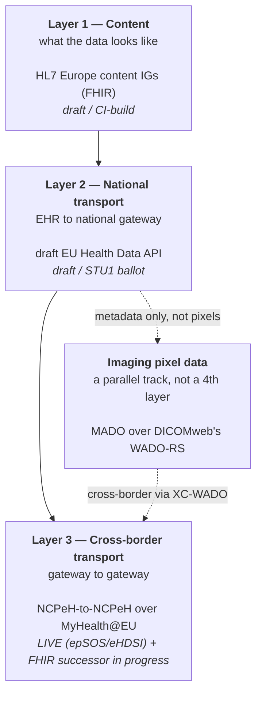
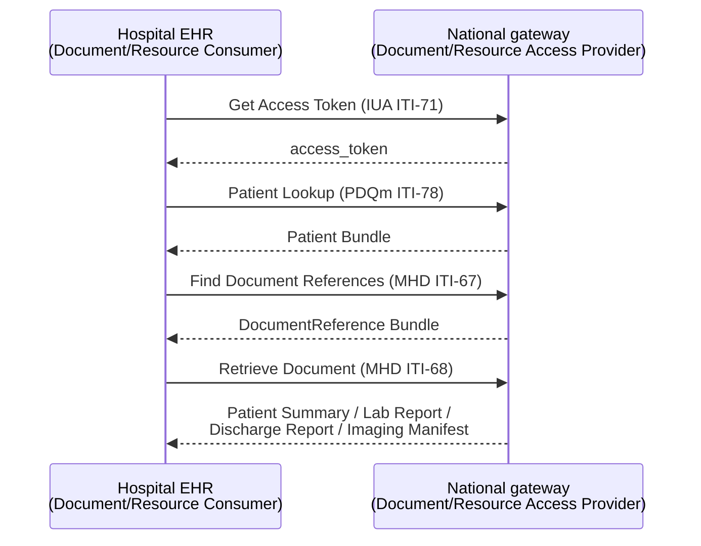

# API drafts and specifications: what exists today

The other files in this folder describe the EEHRxF as "not yet formally established" in the abstract. This file goes one level deeper: it identifies the actual draft technical artifacts being built right now, who is building them, what state they are in, and — because that's genuinely useful for evaluating build risk — what the draft resources and APIs concretely look like.

*This is the most acronym-dense file in the set — unfamiliar terms (MADO, MHD, PDQm, IPA, FSH, STU, etc.) are all defined in the [glossary](10-glossary.md).*

> **Methodology note, different from the other files in this folder**: most of this file's sourcing comes from directly reading the public GitHub repositories (`github.com/hl7-eu/*`, `github.com/euridice-org/*`) and their raw source files (`raw.githubusercontent.com`), which **were** reachable in this research environment — unlike EUR-Lex, `build.fhir.org`, `euridice.org`, `ihe.net` and most other primary sources, which were blocked by the network egress proxy (same limitation documented in the [overview](index.md)). That means the package IDs, version numbers, dependency lists, and FSH (FHIR Shorthand) source code quoted below are read directly from the authoritative source repositories, not search-engine synthesis — higher confidence than most of the rest of this documentation set. Where a claim instead relies on search-engine synthesis (e.g. the MADO/DICOMweb relationship, the ballot timeline), that is flagged explicitly.

## Who is actually drafting these specs

The technical work feeding the EEHRxF is done by **[EURIDICE](https://euridice.org/)** ("European Interoperability Specifications for Digital Solutions in Healthcare"), a joint initiative of **HL7 Europe** and **IHE Europe**. EURIDICE combines HL7's FHIR authoring process with IHE's profiling/actor-transaction methodology and connectathon testing, explicitly to produce specifications that support "the requirements of the EHDS regulation" (search synthesis of [euridice.org](https://euridice.org/) and the [HL7 Europe/IHE-Europe joint ballot announcement](https://www.hl7europe.org/hl7-europe-and-ihe-europe-open-coordinated-ballots-for-european-fhir-implementation-guides-developed-jointly-in-the-euridice-collaboration/)). This is an industry/professional-association-led technical process — not the European Commission itself — that is expected to feed into the Commission's own binding "common specifications" implementing act due by 26 March 2027 under Article 36 (see [02-implementation-timeline.md](02-implementation-timeline.md)); no source found in this research states that the Commission has formally adopted EURIDICE's output as-is, so treat these as the leading technical *candidates*, not yet law.

There are three layers of draft/live specification in play, plus one specialized track that cuts across two of them:

1. **Content** (HL7 Europe content IGs) — defines what the clinical data looks like as FHIR resources, one per EEHRxF priority category.
2. **National transport** (the draft EU Health Data API, EURIDICE joint project) — defines how an EHR system actually calls the national gateway to get that data: authentication, discovery, patient matching, and the REST operations themselves.
3. **Cross-border transport** (NCPeH-to-NCPeH over MyHealth@EU) — a separate layer again, "governed separately" from layer 2, and — unlike layers 1 and 2 — already **live today**, just running on the older epSOS/eHDSI generation rather than FHIR.

**Imaging is the exception that cuts across layers 2 and 3**: the FHIR-based transport layers above only move metadata (an Imaging Report, or an Imaging Manifest describing which images exist). Actually retrieving the pixel data itself uses **MADO**, a separate DICOM-specific mechanism, at both the national and cross-border legs — covered in full below.



*This diagram is this documentation's own synthesis of the layer structure described throughout this file — it is not a published EU diagram. Layer 3 is the only one already live today, on the older epSOS/eHDSI generation rather than FHIR, with a FHIR-based successor already in active development — see [07-cross-border-exchange.md](07-cross-border-exchange.md) for the detailed workflow diagram, the live open-source implementation, and who is specifying the FHIR migration. The tables and prose above and below give the full detail (package IDs, versions, dependencies) each box here summarizes.*

## The content Implementation Guides (what the clinical data looks like)

All of the following are read directly from each repository's `sushi-config.yaml` (the FHIR IG Publisher's build manifest) via `raw.githubusercontent.com`. All are FHIR **R4** (version `4.0.1`), draft status, licensed CC0-1.0, published by HL7 Europe, and built with the HL7 FHIR Shorthand (FSH)/SUSHI toolchain — the standard modern FHIR IG authoring stack.

| EEHRxF priority category | IG name | Package ID | Version (as read) | Built on | GitHub repo |
|---|---|---|---|---|---|
| Patient summary | HL7 Europe Patient Summary (EPS) | `hl7.fhir.eu.eps` | `1.0.0-ci-build` | [HL7 FHIR International Patient Summary (IPS) 2.0.1](https://hl7.org/fhir/uv/ips/), HL7 EU Base/Extensions, IHE Pharmacy MPD | [hl7-eu/eps](https://github.com/hl7-eu/eps) |
| ePrescription / eDispensation | HL7 Europe Medication Prescription and Dispense (MPD) | (R4 and R5 builds; ID not independently confirmed in this pass) | R4 and R5 branches maintained in parallel | eHN Guidelines on ePrescription, the Xt-EHR project's logical models, jointly developed with **IHE Pharmacy** as the **IHE MPD UV** profile | [hl7-eu/mpd](https://github.com/hl7-eu/mpd) |
| Laboratory results | HL7 Europe Laboratory Report | `hl7.fhir.eu.laboratory` | `2.2.0-ci` | HL7 IPS 2.0.1, HL7 EU Extensions R4 | [hl7-eu/laboratory](https://github.com/hl7-eu/laboratory) |
| Hospital discharge reports | HL7 Europe Hospital Discharge Report (HDR) | `hl7.fhir.eu.hdr` | `1.0.0-ci` | eHN Hospital Discharge Report guidelines, HL7 IPS 2.0.1, HL7 EU Base, IHE Pharmacy profiles | [hl7-eu/hdr](https://github.com/hl7-eu/hdr) |
| Imaging reports | HL7 Europe Imaging Study Report | referenced as `imaging` (R4) and `imaging-r5` repos | R5 build at `0.1.1-build`, per an [STU1 ballot dated 27 March 2026](https://hl7.eu/fhir/imaging-r5/0.1.0-ballot/) (URL found via search, not directly fetched) | HL7 FHIR DiagnosticReport/ImagingStudy patterns | [hl7-eu/imaging](https://github.com/hl7-eu/imaging), [hl7-eu/imaging-r5](https://github.com/hl7-eu/imaging-r5) (R4 variant also exists) |
| Imaging manifests (cross-border image retrieval) | HL7 EU Imaging Manifest (built on IHE MADO) | `hl7.fhir.eu.imaging-manifest` | `0.2.1-build` | **IHE-MADO** profile, IHE MHD, HL7 EU Base/Extensions | [hl7-eu/imaging-manifest](https://github.com/hl7-eu/imaging-manifest) |
| *(foundation, not a priority category)* | HL7 Europe Base and Core | `hl7.fhir.eu.base` | `2.1.0-ci` | Defines `Patient-EU`, `Practitioner-EU`, `PractitionerRole-EU`, `Organization-EU`, plus 17 STU1 core clinical profiles (allergies, conditions, medications, observations, procedures, etc.) that all the content IGs above build on | [hl7-eu/base](https://github.com/hl7-eu/base) |

The HL7 Europe GitHub organization ([github.com/hl7-eu](https://github.com/hl7-eu)) hosts **68 repositories** in total, including several EU-funded-project-specific IGs (Gravitate-Health, IDEA4RC, SYNDERAI, PanCareSurPass) that are out of scope for EHDS proper but reuse the same EU Base profiles.

All of these are self-described as **draft / CI-build / trial-use** — none has reached a stable, versioned "Normative" or even final STU release as of this research. `-ci-build` and `-ci` suffixes specifically mean "continuous integration build," i.e. the live, unballoted tip of the repository — the least stable state a FHIR IG can be in.

## The transport/API layer: the "EU Health Data API"

This is the part that most directly answers "what does the actual API look like." EURIDICE's joint working group publishes a dedicated Implementation Guide, read directly from its `sushi-config.yaml`:

- **Package ID**: `hl7.fhir.eu.health-data-api`
- **Version**: `1.0.0-ballot`
- **FHIR version**: R4 (`4.0.1`)
- **Publisher**: HL7 Europe · **License**: CC0-1.0 · **Jurisdiction**: Europe
- **Repo**: [github.com/euridice-org/eu-health-data-api](https://github.com/euridice-org/eu-health-data-api) (mirrored at [github.com/hl7-eu/health-data-api](https://github.com/hl7-eu/health-data-api))
- **Rendered build**: [hl7.eu/fhir/health-data-api/en/](https://hl7.eu/fhir/health-data-api/en/) and [build.fhir.org/ig/euridice-org/eu-health-data-api/](https://build.fhir.org/ig/euridice-org/eu-health-data-api/) (URLs found via search; not directly fetchable in this environment)

Per its own README: it "specifies API definitions for accessing and exchanging European Electronic Health Record exchange Format (EEHRxF) data between systems, **as required by EHDS Article 15**." Critically, it says it "defines transport and exchange patterns only" — the clinical data models are the separate content IGs listed above; this IG is purely about *how you call the API*, not what the payload looks like.

It does this by **reusing existing international profiles rather than inventing a new API style** — its declared dependencies are:

| Building block | What it's for | Version dependency |
|---|---|---|
| [IHE MHD](https://profiles.ihe.net/ITI/MHD/) (Mobile access to Health Documents) | Document-style query/retrieve (the primary pattern for pulling a Patient Summary, Discharge Report, etc.) | `ihe.iti.mhd` `4.2.x` |
| [IHE PDQm](https://profiles.ihe.net/ITI/PDQm/) (Patient Demographics Query for Mobile) | Patient matching across systems/countries before you can request their data | `ihe.iti.pdqm` `3.2.x` |
| [HL7 IPA](https://hl7.org/fhir/uv/ipa/) (International Patient Access) | Patient-facing (not just professional-facing) FHIR API conventions | `hl7.fhir.uv.ipa` `1.1.x` |
| SMART Backend Services | OAuth2-based system-to-system authorization (no end-user login step — this is how one country's system authenticates to another country's system, not how a patient logs in) | referenced in the IG's functional-requirements pages |
| `hl7.fhir.eu.base` | The EU core resource profiles described above | `2.0.0-ballot` |

In plain terms: **the draft EHDS API is a profiled FHIR REST API, not a bespoke protocol** — a client authenticates via OAuth2/SMART, finds the right patient via a PDQm query, and then pulls their Patient Summary/Discharge Report/etc. as a FHIR document Bundle via an MHD-style document query, with the actual clinical content shaped by the content IGs above. The IG's own page structure (background → regulatory anchors → discovery → authorization → patient matching → document/resource exchange → implementation examples) mirrors that flow.

**Priority coverage confirmed in the IG's scope**: Patient Summary, ePrescription/eDispensation, Laboratory Results, Imaging Reports, Imaging Manifests, and Hospital Discharge Reports — i.e. explicitly all of the EEHRxF priority categories from Annex I.

**Imaging is covered by this API only for the metadata, not the pixel data.** The EU Health Data API's MHD/PDQm-based pattern is how you'd fetch an Imaging Report or an Imaging Manifest as a FHIR resource — same as any other document. But actually retrieving the imaging *study itself* (the DICOM pixel data the manifest points to) does **not** go through this API at all — it goes through **MADO**, a separate, DICOM-specific mechanism layered on top of DICOMweb's WADO-RS, covered in full in [the next section](#imaging-specifically-mado-and-how-it-relates-to-dicomweb). In the three-layer picture below, MADO is a specialized sibling of this transport layer, not a replacement for it.

## Two directions: EHDS requires EHRs to both provide access and receive data

Everything above frames the EU Health Data API from the "publish/serve your own data" side — but the Regulation itself, and the IG built on it, are explicit that this is only half of what's required. The other half is exactly the "can my own clinicians view a patient's data, including data that arrived from another country" question. Read directly from the IG's regulatory-traceability page ([`regulatoryAnchors.md`](https://github.com/euridice-org/eu-health-data-api/blob/main/input/pagecontent/regulatoryAnchors.md)):

> **EHDS Annex II §2.1**: *"SHALL provide an **interface enabling access** to the personal electronic health data [formatted in EEHRxF]"*
> **EHDS Annex II §2.2**: *"SHALL **be able to receive** personal electronic health data [formatted in EEHRxF]"*

The IG's underlying requirements source (the Xt-EHR Joint Action's Deliverable 5.1) interprets these as two symmetric halves of one query-based architecture, and maps each to its own IG actor:

| Regulation | D5.1 interpretation | IG actor |
|---|---|---|
| Annex II §2.1 "provide interface enabling access" | **Producer** side: serve queries for EEHRxF data | **Access Provider** (Document Access Provider / Resource Access Provider) |
| Annex II §2.2 "be able to receive" | **Consumer** side: initiate queries and receive/process the response | **Consumer** (Document Consumer / Resource Consumer) |

Both sides are phrased as **SHALL** (mandatory) requirements in the IG's own requirements-traceability table — the Consumer side is not an optional extra:

| Requirement ID | Requirement text (quoted) | Actor |
|---|---|---|
| `api-provider-doc` | "The EHR system... SHALL offer an API that enables an external system to access and retrieve its priority category data" | Access Provider |
| `api-consumer-doc` | "The EHR system... SHALL support an external document query API" | Consumer |
| `api-consumer-resource` | "The EHR system... SHALL support an external resource query API" | Consumer |
| `api-consumer-data` | "The EHR system SHALL be able to receive and handle data conforming to the EEHRxF data format" | Consumer |

**The Document Consumer / Resource Consumer actors, concretely**, per [`actors.md`](https://github.com/euridice-org/eu-health-data-api/blob/main/input/pagecontent/actors.md):

- **Document Consumer** — *"Consumes EEHRxF FHIR documents by querying a Document Access Provider."* Built from an IUA Authorization Client, a PDQm Patient Demographics Consumer, and an MHD Document Consumer — concretely: get an access token (ITI-71), look up the patient (PDQm ITI-78), find document references (MHD ITI-67), then retrieve the document itself (MHD ITI-68).
- **Resource Consumer** — *"A FHIR client that consumes external FHIR resources by querying a Resource Access Provider,"* built on the same authorization/patient-lookup steps plus an HL7 IPA client for the actual resource query.



*This is the "viewing" path — the mirror image of the publish/serve path described above. It's what actually lets a clinician using this EHR see a patient's data at the point of care, including data the national gateway itself pulled in from another country's NCPeH (see [07-cross-border-exchange.md](07-cross-border-exchange.md)). From the EHR's point of view, both a domestic record and a cross-border-sourced one arrive through this same Layer 2 Consumer call — already translated and normalized by the national gateway before it ever reaches the EHR.*

**This is not a hypothetical extra.** The IG's own deployment-pattern page ([`usecase-cross-org.md`](https://github.com/euridice-org/eu-health-data-api/blob/main/input/pagecontent/usecase-cross-org.md)) explicitly names "EHRs acting as Document Consumers" and "destination EHR systems acting as Document/Resource Consumers" in *both* of its illustrative national architecture patterns (Central Repository and Federated) — the same two patterns discussed as "Pattern 1/Pattern 2" below.

**Practical implication:** implementing only the *publish*/*Access Provider* side gets an EHR system to "other systems can see my patients' data" — it does not, by itself, let that EHR's own clinicians view a patient's incoming or foreign-sourced data. That is a separate, equally-mandatory capability (the Consumer role), plus — beyond the wire protocol — genuine clinical-UI work to actually render an incoming FHIR document Bundle (which may arrive in another country's language and section layout) in a way a clinician can use at the point of care. See [08-vendor-checklist.md](08-vendor-checklist.md) for how this folds into the practical build checklist.

## Will EHR vendors (Dedalus, etc.) have to implement this API directly, or will a national gateway do it for them?

This is genuinely the single most consequential open design question for a vendor, and the IG itself answers it directly — read from [`member-state-architectures.md`](https://github.com/euridice-org/eu-health-data-api/blob/main/input/pagecontent/member-state-architectures.md) in the EU Health Data API repo. **The spec deliberately does not decide this — it explicitly states "this IG does not prescribe" the national infrastructure design, and instead defines only "the API surface at the EHR system boundary," leaving Member States to choose the architecture.** Two named patterns exist in the source text:

| | Pattern 1: Centralized repository | Pattern 2: Federated query |
|---|---|---|
| **Who plays "Access Provider" (the server that answers FHIR queries)?** | The **national repository/gateway** | **Each hospital's own EHR system** |
| **What the EHR vendor implements** | Only a *publish* transaction (IHE ITI-105, "Provide Document Bundle") to push data up to the national repository. **"EHR systems do not need to host a query API"** — quoted directly from the IG. | The **full Document/Resource Access Provider role**: a live, publicly-reachable query + retrieval endpoint, kept online and conformant at all times. |
| **Named as common in** | "Existing national XDS/XCA deployments" — i.e. countries that already run a national document repository on the older IHE XDS/XCA profiles, which describes Finland (Kanta), and by the same logic plausibly Austria (ELGA), Denmark, France (DMP/Mon espace santé) and Estonia — the same countries already identified as "centralized-gateway" states in [04-other-member-states.md](04-other-member-states.md) | **The Netherlands and Sweden**, named explicitly in the source text — consistent with the more vendor/region-fragmented pattern for those countries already documented in [04-other-member-states.md](04-other-member-states.md) |
| **Practical implication for a vendor like Dedalus** | Lower integration burden per deployment, but the *national gateway operator* (e.g. Kela/Kanta in Finland) becomes the real technical gatekeeper and the entity actually implementing/maintaining EHDS conformance | Higher integration burden — the vendor's own product must implement and keep conformant a live FHIR Access Provider — but also more direct control and less dependence on a third party's roadmap |

So: **it is not "vendors will/won't implement the API" — it's a per-country architecture decision, and the answer is already visibly different across the countries this documentation covers.** In a Pattern 1 country, Dedalus (or any HIS vendor) would mainly need to add a document-publish capability pointed at the national repository — the "wrapper" the question asks about is exactly the national gateway acting as Access Provider on the vendor's behalf. In a Pattern 2 country, the vendor is the wrapper — there is no intermediary insulating them from the API's technical requirements.

> **This Pattern 1/Pattern 2 choice is specifically about the *serving* (Access Provider) side — who answers queries *from* others.** It is a separate question from the Consumer/viewing side described [above](#two-directions-ehds-requires-ehrs-to-both-provide-access-and-receive-data). Even in a Pattern 1 country, where the EHR "does not need to host a query API" for others, the EHR still typically needs to act as a Document/Resource **Consumer** itself if its own clinicians are going to view incoming data — domestic or cross-border — inside the product, rather than relying on some separate national viewer application. Nothing in the source text found in this research suggests Pattern 1 exempts a vendor from also implementing the Consumer role; it only exempts them from being queried by others.

**In both patterns, though, the EHR system's technical boundary is always Layer 2 — it never speaks Layer 3 (cross-border) directly.** The Pattern 1/Pattern 2 choice changes *who* does the work and *who initiates the call* (the EHR pushes in Pattern 1; the national gateway pulls from the EHR in Pattern 2), not *which layer* the EHR touches — in both cases the exchange happens over this Layer 2 national-transport surface. Layer 3 (NCPeH-to-NCPeH) is a structurally separate protocol whose only two participants, in every source found, are national gateways; no source describes a hospital EHR system directly implementing or speaking the cross-border protocol. The national gateway is the mandatory intermediary that translates between the two, regardless of which national pattern a country chooses.

**Cross-border (Layer 3) is a separate layer again**, per the [layer diagram above](#who-is-actually-drafting-these-specs). Per [`usecase-cross-border-ncp.md`](https://github.com/euridice-org/eu-health-data-api/blob/main/input/pagecontent/usecase-cross-border-ncp.md) in the same repo: this IG **only** specifies Layer 2, the national leg (EHR system ↔ national infrastructure). The country-to-country leg — one country's NCPeH querying another country's NCPeH over MyHealth@EU — is explicitly called out as **"governed separately by the NCPeH API specification."** Cross-border exchange has enough depth (a live, open-source implementation today; an in-progress FHIR successor; the actual workflow mechanics; who specifies the FHIR migration) that it has **its own dedicated chapter: [07-cross-border-exchange.md](07-cross-border-exchange.md)**.

> ⚠️ **Unverified / conflicting sources**: These quotes and architectural patterns are read directly from the IG's own GitHub source (`raw.githubusercontent.com`), which is higher-confidence than most of this documentation set — but the rendered/build version of the IG (`build.fhir.org`, `hl7.eu/fhir`) could not be directly fetched to cross-check formatting or see if this page has since been revised. The claim that Finland/Austria/Denmark/France/Estonia specifically use "Pattern 1" is this document's own inference from the general "existing national XDS/XCA deployments" description plus the country profiles in [04-other-member-states.md](04-other-member-states.md) — the source text names the pattern-category, not those specific five countries by name.

*For the practical question — "which APIs does an EHR vendor need to implement to sell across the whole EU, and is that the same everywhere?" — see [08-vendor-checklist.md](08-vendor-checklist.md).*

## Imaging specifically: MADO, and how it relates to DICOMweb

This is worth its own section since it's a common point of confusion. **DICOMweb** (the modern REST-based successor to the classic DICOM network protocol, covering QIDO-RS for query, WADO-RS for retrieve, STOW-RS for store) is the underlying **transport** standard for moving actual pixel data. It is not itself an EHDS-specific artifact — it predates EHDS by years and is already widely deployed in PACS/imaging infrastructure.

What EHDS specifically triggered is a **new IHE Radiology profile called MADO — Manifest-based Access to DICOM Objects** ([IHE supplement PDF](https://www.ihe.net/uploadedFiles/Documents/Radiology/IHE_RAD_Suppl_MADO.pdf); draft text also mirrored at [euridice.org/mado](https://euridice.org/mado/), neither directly fetchable here). Per search-engine synthesis of these sources: *"the need for this profile was identified as part of the sharing of imaging studies and related reports as required under the EHDS Regulation."* MADO does not replace DICOMweb — it sits **above** it:

- A **manifest** is a structured list of "which imaging objects constitute the study" for a given purpose (e.g. "everything relevant to this referral," not necessarily every image ever taken of the patient). This is the part MADO actually defines.
- The manifest itself can be expressed **either** as a classic DICOM Key Object Selection (KOS) document **or** as a FHIR `ImagingStudy` resource — MADO is explicitly format-agnostic at this layer, which is why HL7 Europe's companion `imaging-manifest` FHIR IG exists (the FHIR-flavored expression of the same manifest concept).
- Actually **retrieving** the image data referenced by the manifest is done via a "solid profiling of WADO-RS consistent with the XC-WADO Cross-Community profile and the IID (Invoke Image Display) profile" — i.e. DICOMweb's WADO-RS is still the retrieval mechanism; MADO constrains and governs *which* objects you're allowed/expected to ask for and why, rather than replacing the retrieval protocol itself.

So: **DICOMweb is the plumbing; MADO is the EHDS-driven governance/manifest layer built on top of it; the `imaging-manifest` FHIR IG is HL7 Europe's FHIR expression of a MADO manifest.** All three pieces are draft/pre-STU as of this research.

## What the drafts actually look like: real examples

The content IGs are authored in **FHIR Shorthand (FSH)** — a compact, human-readable DSL that the SUSHI compiler turns into full FHIR JSON/XML. Reading the FSH source is the fastest way to see the actual shape of a resource. The following is the **complete, real, unmodified content** of one of the HL7 Europe Patient Summary IG's own example files (an Austrian Patient Summary example bundle), fetched directly from [`hl7-eu/eps`](https://github.com/hl7-eu/eps/blob/master/input/fsh/examples/EPS-at-aps-example-bundle-01-no-problems-medication-allergies.fsh):

```fsh
Instance: EPSExampleBundle01NoProblemsMedicationAllergies
InstanceOf: BundleEuEps
Title: "Bundle: Empty EPS"
Description: "Example of a minimal empty HL7 Europe Patient Summary (EPS) FHIR Bundle - No problems, medications, allergies [Maria Musterfrau]"
Usage: #example
* identifier.system = $uuid
* identifier.value = "63fef90a-be11-4ddf-aece-d77da15c4f20"
* type = #document
* timestamp = "2024-02-08T14:01:30+00:00"
* entry[0].fullUrl = "urn:uuid:212fdc76-ccc3-40bf-8cdd-82f2ef88bd7b"
* entry[=].resource = EPSExampleBundle01-composition
* entry[+].fullUrl = "urn:uuid:0fed5ebe-ca8f-4ad1-aba4-ddad45bd6cc8"
* entry[=].resource = EPSExampleBundle01-patient
* entry[+].fullUrl = "urn:uuid:75db30ee-7028-486c-929a-c5126837f472"
* entry[=].resource = EPSExampleBundle01-author
* entry[+].fullUrl = "urn:uuid:6bcdcc96-1443-48bd-ab41-7692dc1baecd"
* entry[=].resource = EPSExampleBundle01-custodian

Instance: EPSExampleBundle01-composition
InstanceOf: CompositionEuEps
Usage: #inline
* status = #preliminary
* identifier.system = "urn:ietf:rfc:9562"
* identifier.value = "f4d1c16a-3421-43b1-9c74-dac7fcb52ca4"
* type = $loinc#60591-5 "Patient summary Document"
* subject = Reference(urn:uuid:0fed5ebe-ca8f-4ad1-aba4-ddad45bd6cc8) "Maria Musterfrau"
* date = "2024-02-08T14:01:30+00:00"
* author = Reference(urn:uuid:75db30ee-7028-486c-929a-c5126837f472) "APS Generator"
* title = "Austrian Patient Summary"
* custodian = Reference(urn:uuid:6bcdcc96-1443-48bd-ab41-7692dc1baecd) "Muster-Organization"
* section[sectionMedications].title = "Medikationsliste"
* section[sectionMedications].code = $loinc#10160-0 "History of Medication use Narrative"
* section[sectionMedications].emptyReason = $list-empty-reason#nilknown
* section[sectionAllergies].title = "Allergien und Intoleranzen"
* section[sectionAllergies].code = $loinc#48765-2 "Allergies and adverse reactions Document"
* section[sectionAllergies].emptyReason = $list-empty-reason#nilknown
* section[sectionProblems].title = "Gesundheitsprobleme und Risiken"
* section[sectionProblems].code = $loinc#11450-4 "Problem list - Reported"
* section[sectionProblems].emptyReason = $list-empty-reason#nilknown
* section[sectionProceduresHx].title = "Eingriffe und Therapien"
* section[sectionProceduresHx].code = $loinc#47519-4 "History of Procedures Document"
* section[sectionProceduresHx].emptyReason = $list-empty-reason#nilknown
* section[sectionMedicalDevices].title = "Implantate, medizinische Geräte und Heilbehelfe"
* section[sectionMedicalDevices].code = $loinc#46264-8 "History of medical device use"
* section[sectionMedicalDevices].emptyReason = $list-empty-reason#nilknown

Instance: EPSExampleBundle01-patient
InstanceOf: PatientEuEps
Usage: #inline
* name.family = "Musterfrau"
* name.given[0] = "Maria"
* name.given[+] = "Johanna"
* name.prefix = "Dr."
* telecom[0].system = #phone
* telecom[=].value = "+43.2682.40400"
* telecom[=].use = #home
* telecom[+].system = #email
* telecom[=].value = "musterfrau@provider.at"
* gender = #female
* birthDate = "1961-12-24"
* address.line = "Musterstraße 13a"
* address.city = "Eisenstadt"
* address.country = "AUT"
* maritalStatus = $v3-MaritalStatus#M "Married"
```

*(Section `text.div`/narrative-XHTML lines and a couple of repeated `telecom` entries were trimmed for readability; nothing structural was altered. Full file at the link above.)*

A few things this single example already demonstrates about the draft standard's shape:

- It's a **FHIR document Bundle** (`type = #document`) — the same pattern used by the international IPS and by the older cross-border epSOS/eHDSI Patient Summary, so this is evolutionary, not a clean break.
- The `Composition` (the document's "cover sheet") organizes content into standard **LOINC-coded sections** (medications `10160-0`, allergies `48765-2`, problems `11450-4`, procedures `47519-4`, medical devices `46264-8`) — an empty section still has to declare *why* it's empty (`emptyReason = nilknown`), which is a deliberate patient-safety design choice (an absent section is ambiguous; an explicitly-empty section is not).
- Country-specific content — this example is explicitly Austrian (`aps` = Austrian Patient Summary, German-language section titles, `AUT` country code) — is layered **on top of** the shared European base profile (`PatientEuEps`, `CompositionEuEps`), which is the general pattern: one EU base profile, with national "flavors"/extensions per country, rather than one single unlocalized EU-wide format.

For a prescription/dispensing example, the MPD repo's [`prescriptions.fsh`](https://github.com/hl7-eu/mpd/blob/master/input/fsh/examples/prescriptions.fsh) file (not reproduced in full here) includes, among others, a `MedicationRequestEuMpd` instance for a Cefuroxime prescription with a changing dosage schedule, and a more complex `Bundle` example (`100A-multiitem-prescription-with-orchestration`) that wraps three simultaneous `MedicationRequest` resources in a FHIR R5 `RequestOrchestration`/`RequestGroup` for a 42-day, multi-drug treatment cycle — i.e. the draft standard already accounts for real-world multi-item, multi-cycle prescribing, not just the trivial single-drug case.

## Current maturity and the ballot timeline

Search-engine synthesis (not independently fetched) of the [HL7 Europe/IHE-Europe joint announcement](https://www.hl7europe.org/hl7-europe-and-ihe-europe-open-coordinated-ballots-for-european-fhir-implementation-guides-developed-jointly-in-the-euridice-collaboration/):

- **27 March 2026**: HL7 Europe and IHE-Europe jointly opened **coordinated ballots** for two EURIDICE-developed IGs — the **Imaging Study Report** and the **EU Health Data API** — described as "the first Standard for Trial Use (STU1) release" of these specifications and "the first joint ballot conducted by IHE-Europe and HL7 Europe."
- **30 April 2026**: ballot/comment deadline. Voting rights were restricted to HL7 Europe affiliates (for the HL7 side) and IHE-Europe National Deployment Committees/identified contacts (for the IHE side) — i.e. this is a formal standards-development-organization ballot process, not an open public comment period.
- **As of this research (September 2026)**, no source was found confirming the ballot's outcome, reconciliation, or a subsequent published STU1 release — the most recent *confirmed* status is "opened for ballot, STU1 candidate." This is itself a useful data point: roughly five months after the ballot closed, there is no public evidence the specifications have been finalized even to first-STU status, let alone adopted into the Commission's binding common specifications (due by treaty deadline six months later, 26 March 2027). Treat this gap as a live risk signal, not settled fact — it may simply mean reconciliation is happening privately; a vendor should verify current status directly at [hl7.eu/fhir/](https://hl7.eu/fhir/) or [euridice.org](https://euridice.org/) rather than relying on this snapshot.
- The other content IGs (EPS, Laboratory, HDR, Base/Core) are, per their own `sushi-config.yaml` version strings (`-ci-build`, `-ci`), still at the **unballoted continuous-integration stage** — earlier in the maturity pipeline than the two IGs that reached ballot in March 2026.

## Sources

- [EURIDICE — European Interoperability Specifications for Digital Solutions in Healthcare](https://euridice.org/) (search synthesis; domain blocked for direct fetch)
- [HL7 Europe GitHub organization](https://github.com/hl7-eu) (directly fetched)
- [euridice-org/eu-health-data-api — `member-state-architectures.md`](https://github.com/euridice-org/eu-health-data-api/blob/main/input/pagecontent/member-state-architectures.md) (directly fetched — source for the Pattern 1/Pattern 2 national architecture options)
- [euridice-org/eu-health-data-api — `usecase-cross-border-ncp.md`](https://github.com/euridice-org/eu-health-data-api/blob/main/input/pagecontent/usecase-cross-border-ncp.md) (directly fetched — source for the NCPeH cross-border flow and the "governed separately" statement)
- [euridice-org/eu-health-data-api — `actors.md`](https://github.com/euridice-org/eu-health-data-api/blob/main/input/pagecontent/actors.md) (directly fetched — source for the Access Provider/Consumer/Publisher actor definitions)
- [euridice-org/eu-health-data-api — `resourceExchange.md`](https://github.com/euridice-org/eu-health-data-api/blob/main/input/pagecontent/resourceExchange.md) (directly fetched)
- [euridice-org/eu-health-data-api — `regulatoryAnchors.md`](https://github.com/euridice-org/eu-health-data-api/blob/main/input/pagecontent/regulatoryAnchors.md) (directly fetched — source for the Annex II §2.1/§2.2 quotes, the D5.1 Producer/Consumer interpretation, and the `api-provider-*`/`api-consumer-*` requirements table)
- [euridice-org/eu-health-data-api — `usecase-cross-org.md`](https://github.com/euridice-org/eu-health-data-api/blob/main/input/pagecontent/usecase-cross-org.md) (directly fetched — source for both national architecture patterns explicitly including "EHRs acting as Document/Resource Consumers")
- [euridice-org/eu-health-data-api — `index.md`](https://github.com/euridice-org/eu-health-data-api/blob/main/input/pagecontent/index.md) (directly fetched — IG scope, audience, and priority-category/exchange-pattern mapping)
- [hl7-eu/eps — HL7 Europe Patient Summary](https://github.com/hl7-eu/eps) and its [`sushi-config.yaml`](https://raw.githubusercontent.com/hl7-eu/eps/master/sushi-config.yaml) and [example FSH file](https://raw.githubusercontent.com/hl7-eu/eps/master/input/fsh/examples/EPS-at-aps-example-bundle-01-no-problems-medication-allergies.fsh) (directly fetched)
- [hl7-eu/mpd — HL7 Europe Medication Prescription and Dispense](https://github.com/hl7-eu/mpd) and its [`sushi-config.yaml`](https://raw.githubusercontent.com/hl7-eu/mpd/master/sushi-config.yaml) and [`prescriptions.fsh`](https://raw.githubusercontent.com/hl7-eu/mpd/master/input/fsh/examples/prescriptions.fsh) (directly fetched)
- [hl7-eu/laboratory — HL7 Europe Laboratory Report](https://github.com/hl7-eu/laboratory) and its [`sushi-config.yaml`](https://raw.githubusercontent.com/hl7-eu/laboratory/master/sushi-config.yaml) (directly fetched)
- [hl7-eu/hdr — HL7 Europe Hospital Discharge Report](https://github.com/hl7-eu/hdr) and its [`sushi-config.yaml`](https://raw.githubusercontent.com/hl7-eu/hdr/master/sushi-config.yaml) (directly fetched)
- [hl7-eu/imaging-manifest — HL7 EU Imaging Manifest (IHE-MADO)](https://github.com/hl7-eu/imaging-manifest) and its [`sushi-config.yaml`](https://raw.githubusercontent.com/hl7-eu/imaging-manifest/master/sushi-config.yaml) (directly fetched)
- [hl7-eu/base — HL7 Europe Base and Core](https://github.com/hl7-eu/base) and its [`sushi-config.yaml`](https://raw.githubusercontent.com/hl7-eu/base/master/sushi-config.yaml) (directly fetched)
- [euridice-org/eu-health-data-api — EU Health Data API](https://github.com/euridice-org/eu-health-data-api) (directly fetched) / mirror at [hl7-eu/health-data-api](https://github.com/hl7-eu/health-data-api)
- [euridice-org/eu-health-data-api `sushi-config.yaml`](https://raw.githubusercontent.com/euridice-org/eu-health-data-api/main/sushi-config.yaml) (directly fetched)
- [IHE International — MADO Radiology supplement (PDF)](https://www.ihe.net/uploadedFiles/Documents/Radiology/IHE_RAD_Suppl_MADO.pdf) (search synthesis; domain blocked for direct fetch)
- [euridice.org/mado — Manifest-Based Access to DICOM Objects](https://euridice.org/mado/) (search synthesis; domain blocked for direct fetch)
- [Runbeam — "MADO and DICOMweb: Understanding the new proposal for Manifest-based DICOM access"](https://runbeam.io/blog/mado-dicomweb-manifest-based-imaging) (search synthesis; industry blog, not a primary standards source)
- [HL7 Europe — press release on the joint EURIDICE ballots](https://www.hl7europe.org/hl7-europe-and-ihe-europe-open-coordinated-ballots-for-european-fhir-implementation-guides-developed-jointly-in-the-euridice-collaboration/) (search synthesis; domain not directly fetched)
- [HL7 Europe FHIR IG portal](https://www.hl7.eu/fhir/) and [EU Health Data API rendered IG](https://hl7.eu/fhir/health-data-api/en/) and [Imaging Study Report R5 rendered IG](https://hl7.eu/fhir/imaging-r5/0.1.0-ballot/) (URLs found via search; domain blocked for direct fetch — verify directly before relying on rendered content)
- [HL7 FHIR International Patient Summary (IPS) Implementation Guide](https://hl7.org/fhir/uv/ips/) — the base standard nearly every HL7 Europe content IG depends on
- [IHE MHD (Mobile access to Health Documents) profile](https://profiles.ihe.net/ITI/MHD/)
- [IHE PDQm (Patient Demographics Query for Mobile) profile](https://profiles.ihe.net/ITI/PDQm/)
- [HL7 International Patient Access (IPA) Implementation Guide](https://hl7.org/fhir/uv/ipa/)
