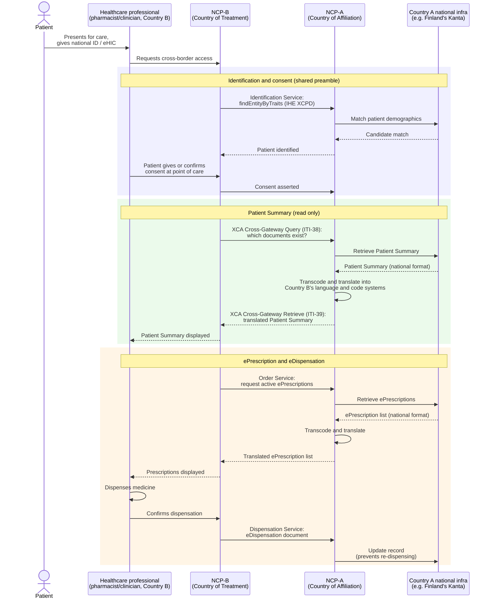
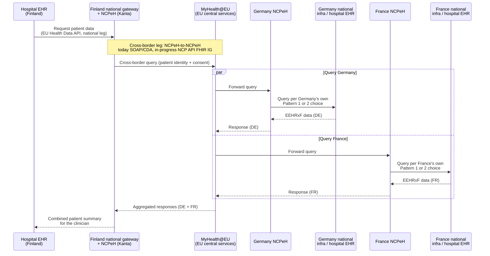

# Cross-border exchange: how it works today, and how it's changing

Cross-border primary-use exchange (MyHealth@EU / NCPeH-to-NCPeH — "Layer 3" in [06-api-drafts-and-specifications.md](06-api-drafts-and-specifications.md)'s layer model) has its own chapter because it is the one layer that is simultaneously **live in production today** and **actively being rebuilt for FHIR** — a different situation from the content IGs and the EU Health Data API, which are still draft/pre-live. This file covers: how the architecture works, whether live open-source implementations exist, exactly how a cross-border Patient Summary/ePrescription exchange works today, and what's known about the move to FHIR and who is specifying it.

*Secondary-use cross-border exchange (HealthData@EU, for research/policy access) is a related but separate network — see [05-gateway-market-and-api-status.md](05-gateway-market-and-api-status.md) for that.*

## How MyHealth@EU/NCPeH is architected

MyHealth@EU (eHDSI) is a **federated architecture**: the European Commission runs shared central/cross-cutting ICT services (terminology, configuration, cross-border trust), and each Member State builds and operates exactly **one National Contact Point for eHealth (NCPeH)** that connects to it. This is a **single national gateway per country, not a competitive multi-vendor field**. The NCPeH exposes the country's own eHealth services abroad, exposes other countries' services domestically, and manages authentication, consent, and semantic/syntactic matching between national and EU data variants ([search synthesis of noze.it / NCPeH wiki / eHealth Network guidance](https://www.noze.it/en/insights/ips-myhealth-eu-crossborder/); [NCPeH CY](https://ncpeh.cy/en/national-contact-points/)).

Member States must establish and operate the NCPeH following eHealth Network guidelines, coordinated via the **eHealth DSI EU countries Expert Group (eHMSEG)** — composed of the managers nominated by each participating country who are responsible for implementing the NCPeH, coordinating its technical and organisational rollout, ensuring interoperability, and advising the eHealth Network and the European Commission ([eHealth Network guideline document](https://www.ncpehealth.gr/files/04_guideline_on_an_organizational_framework_for_ncpeh.pdf); search synthesis on eHMSEG's role). Concrete examples of who operates the NCPeH: in **France**, the NCPeH "Sesali" is created and operated by **ANS** (Agence du Numérique en Santé) under mandate of the French Ministry of Health ([ANS/esante.gouv.fr](https://ue.esante.gouv.fr/defining-european-ehealth-framework-and-contributing-common-approach/ncpeh-sesali)); in **Cyprus**, the NCPeH platform is operated/supported by the **National Electronic Health Authority (NeHA)**, a national public authority ([NeHA Cyprus](https://neha.org.cy/en/national-contact-points/)).

## Do live NCPeH implementations already exist, and are they open source?

**Yes to both — but this is the older generation of the technology**, distinct from the new FHIR-based drafts described in [06-api-drafts-and-specifications.md](06-api-drafts-and-specifications.md). It's worth being precise about which "NCPeH" is being discussed, because there are effectively two generations, covered together in this file:

- **What's actually live today**: the **epSOS/eHDSI-generation NCPeH**, built on **SOAP web services and the IHE XCA (Cross-Community Access) profile**, exchanging documents in the older HL7 CDA format (not FHIR). This is the operational MyHealth@EU network that has been running since the epSOS pilot era and is what Finland and Estonia used for the first live cross-border ePrescription exchange in 2019 (see [03-finland.md](03-finland.md)).
- **What's already being built as a FHIR-based successor**: covered in [its own section below](#is-this-changing-to-fhir-and-who-is-specifying-it) — unlike the EU Health Data API (the EHR-facing layer), this is not a research gap; a real, versioned, actively-developed FHIR IG for this exact layer was found.

**The open-source reference implementation for the live generation is called OpenNCP.** It is described as being under the direct responsibility of the European Commission's DG SANTE, developed as part of the CEF/eHDSI programme, explicitly "dedicated to remain open-source," with governance intended to be driven by the OpenNCP community and health care professionals in cooperation with the Commission (search synthesis of [CEF Digital wiki pages](https://ec.europa.eu/cefdigital/wiki/display/EHNCP/OpenNCP+Release+Notes) and the [OpenNCP Confluence space](https://openncp.atlassian.net/wiki/spaces/ncp/pages/40828931/Connecting+Europe+Facility+CEF); domains not directly fetchable). Its canonical source repository is hosted on the EU's own GitLab instance at [code.europa.eu/ehdsi/ehealth](https://code.europa.eu/ehdsi/ehealth) (also referenced historically at `ec.europa.eu/cefdigital/code` and `ec.europa.eu/digital-building-blocks/code`, reflecting the platform's several rebrandings over the years) — none of these EU-hosted code platforms were directly fetchable in this research environment, so the license and current repository state could not be independently confirmed beyond what search-engine synthesis reports (EUPL, the EU's own open-source license, is the license most consistently reported across sources).

**Real national implementations, confirmed by directly reading their public source code:**

| Country | Repository | License | Confirmed built on OpenNCP? |
|---|---|---|---|
| Denmark | [Sundhedsdatastyrelsen/ehdsi](https://github.com/Sundhedsdatastyrelsen/ehdsi) | MIT | **Yes** — explicitly, the repo's own NCP folder is described as containing "the OpenNCP setup," with a separate national-connector component bridging to Danish national infrastructure |
| Germany | [gematik/api-ncpeh](https://github.com/gematik/api-ncpeh) | EUPL-1.2 | Not confirmed either way in the README — gematik's own description doesn't mention OpenNCP, consistent with Germany's generally more independent/in-house technical approach documented in [04-other-member-states.md](04-other-member-states.md) |

Both repositories are directly browsable, actively-committed public code (Denmark's shows 466 commits; Germany's is explicitly flagged as under active development, with a note that "parts of this code may have been generated using AI-supported technology") — this is about as concrete as "does an implementation exist" evidence gets, short of running the software.

**The architecture splits into a reusable "core" plus a country-specific "national connector."** This is confirmed by an independent, third-party Docker packaging of OpenNCP built for the EU-funded [KONFIDO project](https://link.springer.com/chapter/10.1007/978-3-319-95189-8_2) ([dzobbe/docker-openncp](https://github.com/dzobbe/docker-openncp), Apache-2.0 licensed, directly fetched), which demonstrates a live three-country test setup (Italy querying Spain and Denmark): each country runs its own **National Container** (the generic OpenNCP engine plus that country's connector) with its own database and trust store, and — per the README — "national connectors should be implemented by individual countries, with OpenNCP providing implementation guidance and example code for protocol terminator integration." In other words: **the reusable open-source part is the cross-border protocol engine; each country still writes its own adapter into its national health infrastructure** — the same core pattern (shared engine, national adapter) that recurs throughout this documentation, just for the older SOAP/CDA generation rather than the new FHIR one.

**How many countries are actually live today**: search-engine synthesis of Commission-adjacent sources (not directly fetched — `health.ec.europa.eu` is blocked in this environment) reports Czech Republic, Estonia, Greece, Finland, France, Croatia, Ireland, Lithuania, Luxembourg, Latvia, Malta, Poland and Portugal as live with at least one MyHealth@EU service already; Austria, Cyprus, Denmark, Hungary, Iceland, Italy, Norway, Romania, Sweden and Slovenia are reported as joining through 2025, and Slovakia in 2026 — meaning near-EU/EEA-wide rollout of *some* live NCPeH by the end of this rollout wave, years ahead of the 2029/2031 EHDS-mandated deadlines for the new FHIR-based categories. An older, frequently-cited academic figure (from the original ~2015 OpenNCP paper, [PubMed](https://pubmed.ncbi.nlm.nih.gov/25991222/)) puts early epSOS-era adoption at "10 Member States" — that figure describes the pilot phase, not the current 2026 footprint, and should not be read as today's count.

> ⚠️ **Unverified / conflicting sources**: The exact current OpenNCP license could not be independently confirmed (EUPL is the consistently-reported answer via search synthesis, but the canonical `code.europa.eu` repository itself could not be directly fetched to verify). The live-country list above is search-synthesized from sources not directly fetched and may already be stale given the pace of 2025–2026 rollout activity — verify current status directly at the European Commission's [electronic cross-border health services page](https://health.ec.europa.eu/ehealth-digital-health-and-care/digital-health-and-care/electronic-cross-border-health-services_en) before relying on it.

## How the live cross-border Patient Summary and ePrescription exchange actually works

This is the mechanics of the epSOS/eHDSI-generation flow described above — the thing that's actually running today, using the real named services and IHE transactions from the specification. Two roles recur throughout: **NCP-A**, the National Contact Point of the patient's **country of affiliation** (their home country, which holds the data), and **NCP-B**, the NCP of the **country of treatment** (where the patient currently is). Confirmed via search-engine synthesis of the official [epSOS specification wiki](https://publicwiki-01.fraunhofer.de/epSOS_specification/index.php/EpSOS_National_Contact_Points) (Fraunhofer-hosted; not directly fetchable in this environment) and related sources:

- **Patient identification** uses the epSOS **Identification Service** (`findEntityByTraits()`), which conforms to the **IHE XCPD** (Cross-Gateway Patient Discovery) profile — NCP-B asks NCP-A "does a patient matching these demographic traits exist in your system?"
- **Consent is mandatory and captured in Country B**, at the point of care, before any data can be disclosed — either as fresh, encounter-specific consent, or as a prior general consent the patient already gave, reconfirmed on-site. NCP-A verifies that valid consent exists before releasing anything.
- **Patient Summary retrieval** uses the **IHE XCA** (Cross-Community Access) profile's two-step pattern: a **Cross-Gateway Query (ITI-38)** — "what documents are available?" — followed by a **Cross-Gateway Retrieve (ITI-39)** — "send me that specific document."
- **ePrescription retrieval** uses the epSOS **Order Service**; the returned eDispensation confirmation uses the **Dispensation Service**.
- In both cases, **NCP-A transcodes and translates the content into Country B's code systems and language before sending it** — semantic and linguistic translation happens at the source, not the destination.
- **eDispensation flows the opposite direction**: once the pharmacist in Country B dispenses the medicine, that fact is sent back to NCP-A, which updates the patient's home record — this is what stops the same prescription being dispensed twice.

*This diagram is this documentation's own composition of the named services above into a single end-to-end flow — it is not copied from an official EU diagram, though every service name and transaction code in it is drawn from the epSOS/eHDSI specification. For the authoritative technical reference, see the [epSOS specification wiki — National Contact Points](https://publicwiki-01.fraunhofer.de/epSOS_specification/index.php/EpSOS_National_Contact_Points) and the [epSOS XCA Profile (Fetch Document) page](https://publicwiki-01.fraunhofer.de/epSOS_specification/index.php/EpSOS_XCA_Profile_(Fetch_Document)) for the Patient Summary transactions specifically; for a plainer-English overview, see [noze.it — International Patient Summary and MyHealth@EU](https://www.noze.it/en/insights/ips-myhealth-eu-crossborder/) and the European Commission's own [Electronic cross-border health services page](https://health.ec.europa.eu/ehealth-digital-health-and-care/digital-health-and-care/electronic-cross-border-health-services_en). None of these were directly fetchable in this research environment; all are search-engine-synthesized and should be read directly before being relied on for implementation work.*

> ⚠️ **Unverified / conflicting sources**: This diagram compresses and simplifies the real specification (which defines additional detail this documentation did not independently verify, such as the exact Trusted Service List/PKI trust-establishment steps between NCPs, error handling, and audit logging requirements). Treat it as an accurate high-level mental model of the flow, not a substitute for reading the actual epSOS/eHDSI Technical Framework before building against it.

## Is this changing to FHIR, and who is specifying it?

**Yes — and unlike the EU Health Data API gap flagged in [06-api-drafts-and-specifications.md](06-api-drafts-and-specifications.md), this is not an unresolved question: a real, actively-developed FHIR-based successor for exactly this layer was found.**

The European Commission's own **eHDSI FHIR portal**, at [fhir.ehdsi.eu](https://fhir.ehdsi.eu/) (with an active development/CI-build mirror at [build-fhir.ehdsi.eu](https://build-fhir.ehdsi.eu/)), publishes a **family of MyHealth@EU-branded HL7 FHIR R4 Implementation Guides** — distinct from, though clearly related to, the HL7 Europe/EURIDICE content IGs covered in [06-api-drafts-and-specifications.md](06-api-drafts-and-specifications.md) (different hosting domain, different naming convention, and a notably different version-number lineage, e.g. `v9.1.0`/`v10.0.0-ci` here versus `2.2.0-ci` for HL7 Europe's own Laboratory IG — search synthesis found no source directly explaining the exact governance relationship between the two tracks, flagged below as an open question). The family (per search-engine synthesis of the portal's own listing) includes:

| IG | Covers | Notable version found |
|---|---|---|
| Core | Common profiles and logical models shared by the others | — |
| Patient Summary (EPS) | European Patient Summary | — |
| ePrescription | Electronic prescription and dispensation | — |
| Laboratory | Laboratory results report | `v9.1.0` (published), `v9.1.1` (CI-build) |
| HDR | Hospital Discharge Report | `v0.0.1` (CI-build) |
| Imaging | Medical imaging report | — |
| Vaccination (EuVAC) | Vaccination card — a category not in the EEHRxF priority list covered elsewhere in this documentation | — |
| **NCP API** | **The gateway-to-gateway (NCPeH-to-NCPeH) interface specifications — this is the FHIR successor to the SOAP/XCA layer described above** | `myhealth.eu.fhir.ncp-api#10.0.0-ci` (FHIR 4.0.1, "Local Development" build) |

**Migration status, per search-engine synthesis found directly discussing this**: *"While cross-border ePrescription and eDispensation services continue to operate using HL7 CDA for the near future, new services in MyHealth@EU already use HL7 FHIR, and existing services will adopt HL7 FHIR in the future."* This matches the shape of the data: Laboratory, HDR and Imaging were **never part of the original live epSOS/CDA scope** (only Patient Summary and ePrescription were), so those new categories are being built FHIR-native from the start — while Patient Summary and ePrescription, which **do** have live CDA-based services today, are on a stated-but-undated path to eventually move to FHIR rather than already having done so.

**Who specifies it**: the "NCP API" IG sits on the EU's own official `fhir.ehdsi.eu`/`code.europa.eu` infrastructure (the same institutional home as OpenNCP itself — a related merge request was found directly in the `code.europa.eu/ehdsi/ehealth-portal` project, confirming active development in the same EU-hosted GitLab group), which points to this being specified by the **eHDSI programme itself (European Commission DG SANTE, operationally coordinated through eHMSEG and the NCPeH-manager network)** — a different specifying body from EURIDICE (the HL7 Europe/IHE Europe joint initiative covering the content IGs and the EU Health Data API in [06-api-drafts-and-specifications.md](06-api-drafts-and-specifications.md)). Whether and how the two tracks formally converge (e.g. whether the Commission's eventual Article 36 "common specifications" will simply adopt the eHDSI NCP API IG, the EURIDICE one, or a merger of both) was not found stated anywhere in this research — flagged explicitly as an open gap, not a confirmed fact.

**Is the FHIR successor also open source?** The evidence strongly suggests yes, though a specific license file for the NCP API IG's content could not be directly confirmed (the hosting domains were not directly fetchable). The circumstantial case: it is developed inside the same `code.europa.eu/ehdsi/*` GitLab group that hosts OpenNCP, with publicly-visible ticket numbers and merge requests (e.g. `EHEALTH-12573`) indicating the same open, publicly-trackable development model; OpenNCP itself is consistently reported as EUPL-licensed; and HL7 FHIR Implementation Guides — including every HL7 Europe content IG checked directly in this research (see [06-api-drafts-and-specifications.md](06-api-drafts-and-specifications.md)) — conventionally default to CC0-1.0 (public domain). Whether the eHDSI-branded IGs specifically use EUPL, CC0, the EU's standard institutional reuse licence (CC BY 4.0, the default for European Commission documents under Decision 2011/833/EU), or something else was not independently confirmed — verify directly at [fhir.ehdsi.eu](https://fhir.ehdsi.eu/) before relying on this for a build/reuse decision.

> ⚠️ **Unverified / conflicting sources**: The precise governance relationship between the `fhir.ehdsi.eu` MyHealth@EU IG family and the HL7 Europe/EURIDICE IGs in [06-api-drafts-and-specifications.md](06-api-drafts-and-specifications.md) was not found explicitly stated. No confirmed target date was found for when Patient Summary/ePrescription cross-border exchange will actually cut over from CDA to FHIR in production — only that it is planned. The exact license of the `fhir.ehdsi.eu` IG content was not independently confirmed; the open-source case above is circumstantial (same GitLab group as OpenNCP, HL7 IG convention) rather than a directly read license file.

## What a future, FHIR-based three-country cross-border pull could look like

Putting the draft national-leg API ([06-api-drafts-and-specifications.md](06-api-drafts-and-specifications.md)) and the (eventual, FHIR-based) cross-border leg together, here is what it would look like for a clinician in one country to pull a patient's history from **two** other countries at once — for example, a mobile EU citizen who presents at a Finnish hospital with a documented care history in both Germany and France:

*This diagram is this documentation's own illustration of how the draft national-leg API and the cross-border leg (today's live SOAP/CDA mechanism, or its in-progress FHIR "NCP API" successor above) would compose for a two-country pull — it is not copied from a published EU diagram. Today's live MyHealth@EU primary-use flow typically queries **one** country at a time (the patient's declared country of affiliation for that episode of care); a simultaneous two-country query as drawn here is technically consistent with the federated architecture but was not found documented as an existing product feature in any source reviewed — treat the parallel `par...and...end` branch as an architectural possibility, not a confirmed live capability.*

Two things worth noting in this diagram: first, **Germany and France can each independently be "Pattern 1" or "Pattern 2" internally** (see [06-api-drafts-and-specifications.md](06-api-drafts-and-specifications.md)) — the requesting country (Finland) never needs to know or care, because that choice is hidden behind each country's own NCPeH; the NCPeH-to-NCPeH contract is the only interoperability surface that has to be EU-wide. Second, this is exactly why the "gateway" market question from [05-gateway-market-and-api-status.md](05-gateway-market-and-api-status.md) matters commercially: in a Pattern-1 country the national gateway operator captures nearly all of the EHDS-specific integration work, while in a Pattern-2 country that work (and spend) is distributed across every individual HIS/EHR vendor instead.

## Sources

- [noze.it — IPS/MyHealth@EU cross-border insight](https://www.noze.it/en/insights/ips-myhealth-eu-crossborder/)
- [NCPeH Cyprus — national contact points](https://ncpeh.cy/en/national-contact-points/)
- [eHealth Network — guideline on organizational framework for NCPeH (PDF)](https://www.ncpehealth.gr/files/04_guideline_on_an_organizational_framework_for_ncpeh.pdf)
- [ANS/esante.gouv.fr — NCPeH Sesali](https://ue.esante.gouv.fr/defining-european-ehealth-framework-and-contributing-common-approach/ncpeh-sesali)
- [NeHA Cyprus — national contact points](https://neha.org.cy/en/national-contact-points/)
- [Sundhedsdatastyrelsen/ehdsi — Denmark's NCPeH implementation](https://github.com/Sundhedsdatastyrelsen/ehdsi) (directly fetched)
- [gematik/api-ncpeh — Germany's NCPeH implementation](https://github.com/gematik/api-ncpeh) (directly fetched)
- [dzobbe/docker-openncp — dockerized OpenNCP built for the KONFIDO project](https://github.com/dzobbe/docker-openncp) (directly fetched)
- [OpenNCP Release Notes — CEF Digital wiki](https://ec.europa.eu/cefdigital/wiki/display/EHNCP/OpenNCP+Release+Notes) (search synthesis; domain blocked for direct fetch)
- [OpenNCP — Connecting Europe Facility (CEF) overview, Confluence](https://openncp.atlassian.net/wiki/spaces/ncp/pages/40828931/Connecting+Europe+Facility+CEF) (search synthesis; domain blocked for direct fetch)
- [eHDSI / ehealth — official OpenNCP source repository, EU GitLab](https://code.europa.eu/ehdsi/ehealth) (search synthesis; domain blocked for direct fetch)
- [code.europa.eu/ehdsi/ehealth-portal — merge request EHEALTH-12573 (evidence of active FHIR-related development in the same EU GitLab group as OpenNCP)](https://code.europa.eu/ehdsi/ehealth-portal/-/merge_requests/27) (search synthesis; domain blocked for direct fetch)
- [PubMed — "OpenNCP: a novel framework to foster cross-border e-Health services" (original ~2015 paper, source of the "10 Member States" pilot-era figure)](https://pubmed.ncbi.nlm.nih.gov/25991222/) (search synthesis; not directly fetched)
- [Springer — KONFIDO: An OpenNCP-Based Secure eHealth Data Exchange System](https://link.springer.com/chapter/10.1007/978-3-319-95189-8_2) (search synthesis; not directly fetched)
- [European Commission — Electronic cross-border health services](https://health.ec.europa.eu/ehealth-digital-health-and-care/digital-health-and-care/electronic-cross-border-health-services_en) (search synthesis; domain blocked for direct fetch — source for the live-country rollout list)
- [epSOS specification wiki — National Contact Points](https://publicwiki-01.fraunhofer.de/epSOS_specification/index.php/EpSOS_National_Contact_Points) (search synthesis; Fraunhofer domain blocked for direct fetch — primary technical source for the NCP-A/NCP-B workflow diagram)
- [epSOS specification wiki — XCA Profile (Fetch Document)](https://publicwiki-01.fraunhofer.de/epSOS_specification/index.php/EpSOS_XCA_Profile_(Fetch_Document)) (search synthesis; domain blocked for direct fetch)
- [epSOS specification wiki — XCA Profile (Retrieve Document)](https://publicwiki-01.fraunhofer.de/epSOS_specification/index.php/EpSOS_XCA_Profile_(Retrieve_Document)) (search synthesis; domain blocked for direct fetch)
- [epSOS specification wiki — Informed Consent](https://publicwiki-01.fraunhofer.de/epSOS_specification/index.php/EpSOS_Informed_Consent) (search synthesis; domain blocked for direct fetch)
- [IHE ITI Technical Framework — Cross-Community Patient Discovery (XCPD)](https://profiles.ihe.net/ITI/TF/Volume1/ch-27.html) (search synthesis; not directly fetched)
- [IHE ITI Technical Framework — Cross-Community Access (XCA)](https://profiles.ihe.net/ITI/TF/Volume1/ch-18.html) (search synthesis; not directly fetched)
- [das-e-rezept-fuer-deutschland.de — MyHealth@EU explainer](https://www.das-e-rezept-fuer-deutschland.de/en/advantages/myhealtheu) (search synthesis; domain blocked for direct fetch — plain-English patient-facing overview)
- [fhir.ehdsi.eu — MyHealth@EU FHIR Implementation Guides portal](https://fhir.ehdsi.eu/) (search synthesis; domain blocked for direct fetch)
- [build-fhir.ehdsi.eu/ncp-api — MyHealth@Eu NCPeH API CI-build](https://build-fhir.ehdsi.eu/ncp-api/) (search synthesis; domain blocked for direct fetch)
- [fhir.ehdsi.eu/build/ncp-api/business.html — MyHealth@EU Business View](https://fhir.ehdsi.eu/build/ncp-api/business.html) (search synthesis; domain blocked for direct fetch)
- [fhir.ehdsi.eu/laboratory — MyHealth@Eu Laboratory Report v9.1.0](https://fhir.ehdsi.eu/laboratory/) (search synthesis; domain blocked for direct fetch)
- [hl7.eu/fhir/health-data-api/en/usecase-cross-border-ncp.html — EU Health Data API's own cross-border use case page](https://hl7.eu/fhir/health-data-api/en/usecase-cross-border-ncp.html) (search synthesis; domain blocked for direct fetch)
